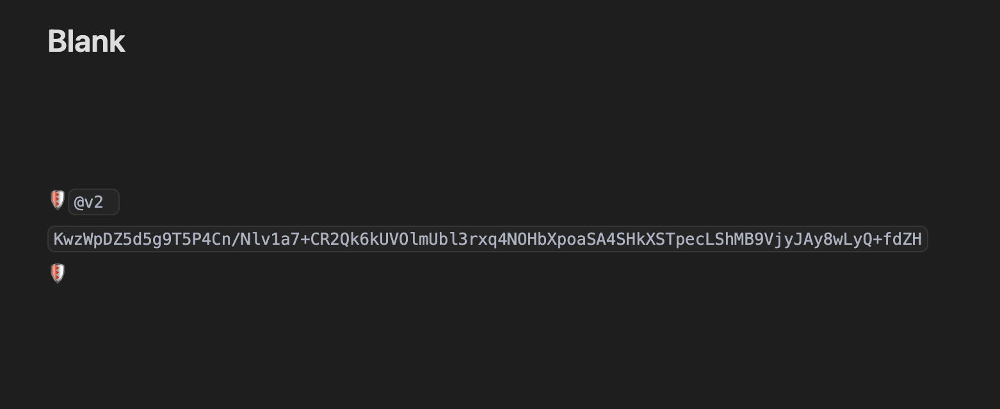
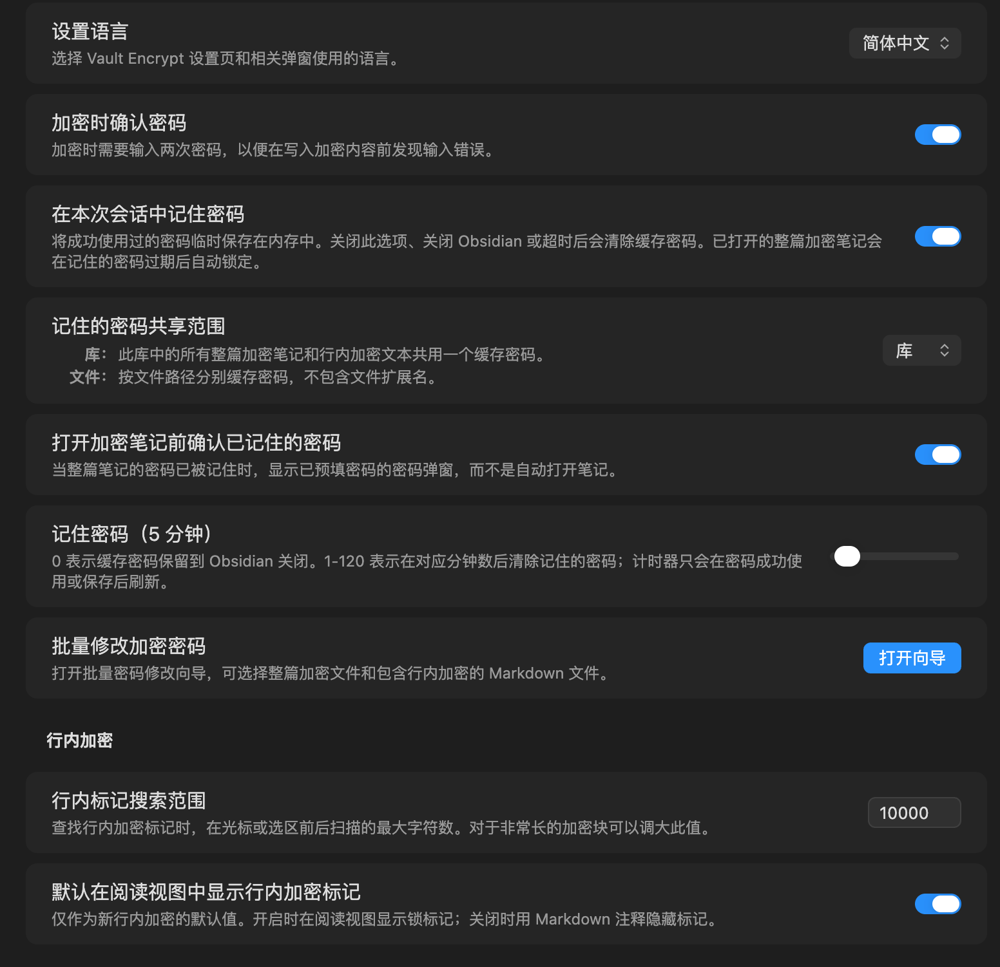
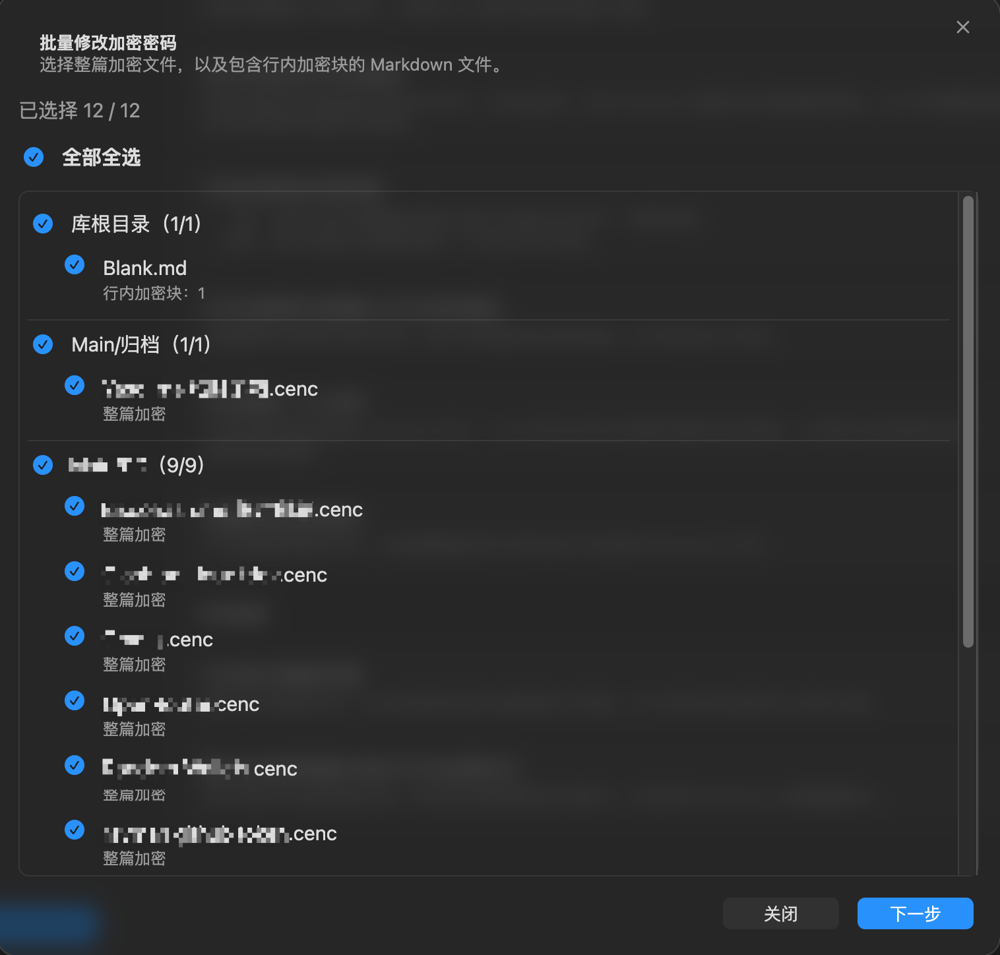
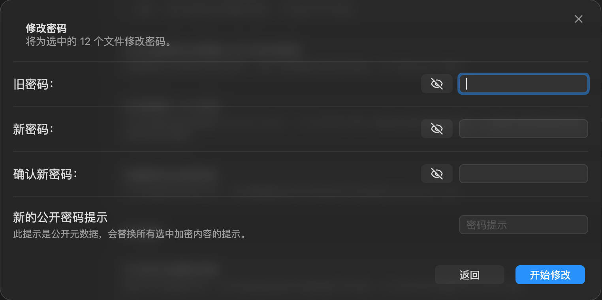

# Vault Encrypt Plugin for Obsidian

[简体中文](README.zh-CN.md)

Vault Encrypt is an Obsidian community plugin for encrypting whole notes and selected inline text inside your vault.

This project is maintained by rayman and is based on the open-source Meld Encrypt project. Official Meld Encrypt GitHub: [meld-cp/obsidian-encrypt](https://github.com/meld-cp/obsidian-encrypt).

Vault Encrypt keeps the original goal of editing encrypted notes in Obsidian while tightening the local security model, simplifying supported formats, and adding workflow features for day-to-day encrypted-note maintenance.

## Security Model

- Whole-note encrypted files are stored as `.cenc` ciphertext files.
- During normal encrypted-note editing, decrypted whole-note contents are not written back to disk.
- Passwords can be remembered only in memory for the current Obsidian session.
- Password hints are public metadata. Do not put secrets in hints.
- If you forget a password, Vault Encrypt cannot recover the encrypted content.
- The crypto implementation has not been independently audited. Keep your own backups.

## What Changed From Meld Encrypt

Compared with the `meld-cp-main` fork base, Vault Encrypt focuses on these functional changes:

| Area | Meld Encrypt | Vault Encrypt |
| --- | --- | --- |
| Whole-note file format | Supports `.mdenc` and `.encrypted` whole-note files, including older encrypted data formats. | Uses `.cenc` for whole-note encrypted files and only supports the current v2 / `2.0` encrypted file data. |
| Inline encryption format | Supports older inline marker formats. | Uses shield `@v2` inline markers, either visible in Reading view or hidden in Markdown comments. |
| Legacy format handling | Keeps older crypto helpers and obsolete inline marker compatibility. | Removes legacy crypto helpers and obsolete inline marker support; unsupported encrypted versions fail in a controlled way. |
| Remembered-password sharing | Supports Vault, Folder, File, and External File password-sharing modes. | Keeps only Vault and File scopes, removing Folder scope and External File password-file caching. |
| Remembered-password timeout | Uses one shared expiry timer for all remembered passwords. The default timeout is 30 minutes; 0 means keep passwords until Obsidian closes. Reading or saving any cached password refreshes the shared expiry for all cached passwords. | Tracks expiry per cached password entry. The default timeout is 30 minutes, configurable from 0 to 120 minutes; 0 means keep passwords until Obsidian closes. Only successful password use or save refreshes that specific entry. |
| Open encrypted notes after timeout | Clearing or expiring remembered passwords does not necessarily close already-open encrypted views. | Clears expired passwords and locks related open whole-note encrypted views. |
| Remembered-password opening flow | A remembered password can open a whole-note encrypted note directly. | Optionally shows a prefilled confirmation dialog before opening with a remembered password. |
| Empty-selection inline encryption | Can prompt for text to encrypt when no text is selected. | Requires an explicit text selection before inline encryption. |
| Password rotation | No batch password rotation wizard. | Adds a mobile-compatible wizard for rotating selected `.cenc` files and Markdown files with inline encrypted blocks, with ciphertext-preserving backups. |
| Localization | Settings UI is primarily English. | Adds plugin-managed English and Simplified Chinese text for settings and related dialogs. |

## Features

### Whole-Note Encryption

- Create new encrypted notes with the `.cenc` extension.
- Open and edit encrypted notes through a custom encrypted Markdown view.
- Convert normal Markdown notes to encrypted `.cenc` notes.
- Decrypt `.cenc` notes back to normal Markdown when explicitly requested.
- Change the password and public hint for an encrypted note.
- Lock and close individual encrypted notes.
- Lock and close all open encrypted notes from the command palette or ribbon.
- Reject unsupported encrypted file versions with a controlled user-facing failure.

### Inline Encryption

- Encrypt an exact text selection inside a normal Markdown note.
- Decrypt inline encrypted text from the command palette, ribbon, or cursor position.
- Show inline encrypted blocks as shield markers in Reading view, or hide them using Markdown comments.
- Reveal decrypted inline text in a modal.
- Copy revealed text, save edited text back into the encrypted marker, or decrypt it in place.
- Store optional public hints inside inline markers.

<p>
  
</p>

### Remembered Passwords

- Remember successfully used passwords in memory only.
- Disable remembered passwords entirely.
- Share remembered passwords by:
  - Vault: one cached password for all encrypted notes and inline encrypted text.
  - File: cached passwords separated by file path, without the extension.
- Set timeout from 0 to 120 minutes.
- Keep cached passwords until Obsidian closes when timeout is 0.
- Refresh timeout only after a password is successfully used or saved.
- Lock open whole-note encrypted views when relevant cached passwords expire.
- Optionally show a prefilled confirmation dialog before opening a whole-note encrypted note with a remembered password.

<p>
  
</p>

### Password Rotation

- Scan the vault for `.cenc` whole-note files and Markdown files containing inline encrypted blocks.
- Group candidates by folder.
- Select individual files, whole folders, or all found candidates.
- Rotate selected items from an old password to a new password.
- Apply one new public hint across all rotated encrypted payloads.
- Create ciphertext-preserving backups under `AA Vault Encrypt Backups/Password Rotation`.
- Detect files changed after precheck and skip them.
- Roll back files already modified if a later write fails.
- Refresh remembered-password cache after successful rotation.

<p>
  
</p>

<p>
  
</p>

### Localization

- Settings and plugin-managed dialogs support English and Simplified Chinese.
- The plugin language is controlled by Vault Encrypt settings and does not follow Obsidian's language automatically.

### Offline Tools

- `tools/decrypt.html` can decrypt supported Vault Encrypt payloads outside Obsidian.
- `tools/mdenc.mjs` provides command-line workflows for supported encrypted Markdown and `.cenc` content.

## Commands

| Command | Purpose |
| --- | --- |
| Create new encrypted note | Create a new `.cenc` encrypted note. |
| Lock and Close all open encrypted notes | Save, lock, and close encrypted note views. |
| Clear Session Password Cache and Lock Notes | Clear remembered passwords and lock open encrypted notes. |
| Convert to or from an Encrypted note | Convert active Markdown notes to `.cenc`, or decrypt `.cenc` notes back to Markdown. |
| Encrypt Selection | Encrypt selected inline text. |
| Decrypt | Reveal or decrypt inline encrypted text. |
| Rotate selected encrypted passwords | Open the batch password rotation wizard. |

## Installation

For local development or manual installation:

1. Run `npm install`.
2. Run `npm run build`.
3. Copy these generated files into your vault plugin folder:
   - `dist/vault-encrypt-<version>/vault-encrypt/main.js`
   - `dist/vault-encrypt-<version>/vault-encrypt/manifest.json`
   - `dist/vault-encrypt-<version>/vault-encrypt/styles.css`

The target folder should be:

```text
<your-vault>/.obsidian/plugins/vault-encrypt/
```

## Development

```bash
npm install
npm run build
npm run build-tool-decrypt
npm run build-tool-mdenc
```

Useful validation checks:

```bash
npm run build
git diff --check
rg -n "^[[:space:]]*console\\." src --glob '!src/tools/**'
```

## Compatibility Notes

Vault Encrypt intentionally does not maintain compatibility aliases for old plugin IDs, command IDs, view types, or CSS classes.

Older Meld Encrypt whole-note formats and old inline marker formats are not supported by the current runtime. Keep backups before replacing an existing plugin installation.
